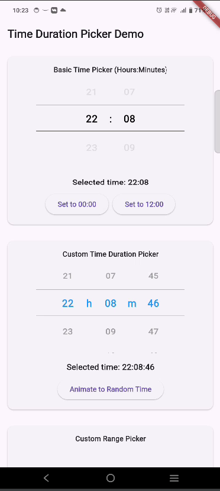

# Flutter Time Duration Picker

A highly customizable time duration picker for Flutter that allows creating flexible time pickers with multiple columns.

---

## Features

- **Multiple Column Types**: Configure hours, minutes, seconds, or custom values.
- **Fully Customizable**: Style and behavior can be tailored to match your app's requirements.
- **Initial Value Support**: Start with predefined time durations.
- **Callbacks**: Receive real-time updates on user selection.
- **Easy-to-Use API**: Builder methods for effortless setup.

---

## Installation

Add the package to your `pubspec.yaml` file:

```yaml
dependencies:
  flutter_time_duration_picker: ^0.1.0
```

Then, run:

```bash
flutter pub get
```

---

## Usage

Here's a quick example:

```dart
import 'package:flutter_time_duration_picker/flutter_time_duration_picker.dart';

class MyApp extends StatelessWidget {
  @override
  Widget build(BuildContext context) {
    return MaterialApp(
      home: Scaffold(
        appBar: AppBar(title: Text('Time Duration Picker Example')),
        body: Center(
          child: TimeDurationPicker(
            columns: [
              TimePickerColumn.hours(),
              TimePickerColumn.minutes(),
            ],
            initialDuration: Duration(hours: 1, minutes: 30),
            onChanged: (Duration value) {
              print('Selected duration: $value');
            },
          ),
        ),
      ),
    );
  }
}
```

---

## Screenshots & Demos

### Screenshots



### Demo Video

[](assets/screen_recording.mp4)

---

## Customization

### Styling

You can customize the appearance of the picker by modifying parameters such as colors, fonts, and column width. Here's an example:

```dart
@
TimeDurationPicker(
  columns: [TimePickerColumn.hours(), TimePickerColumn.minutes()],
  style: TimePickerStyle(
    activeColor: Colors.blue,
    inactiveColor: Colors.grey,
    columnWidth: 60.0,
  ),
)
```

### Custom Columns

Define your own columns with custom values:

```dart
@
TimeDurationPicker(
  columns: [
    TimePickerColumn.custom([
      'A', 'B', 'C',
    ]),
  ],
  onChanged: (Duration value) {
    print('Selected custom value: $value');
  },
)
```

---

## Contributing

Contributions are welcome! Here's how you can contribute:

1. Fork the repository on GitHub.
2. Create a new branch for your feature or bug fix:
   ```bash
   git checkout -b my-new-feature
   ```
3. Make your changes and write tests if applicable.
4. Ensure the tests pass:
   ```bash
   flutter test
   ```
5. Submit a pull request with a detailed explanation of your changes.

GitHub Repository: [flutter_time_duration_picker](https://github.com/tushar-agrawal-21/flutter_time_duration_picker)

---

## Issues

If you encounter any problems or have feature requests, please file an issue on GitHub:

[Report an Issue](https://github.com/tushar-agrawal-21/flutter_time_duration_picker/issues)

---

## License

This package is licensed under the MIT License. See the [LICENSE](https://github.com/tushar-agrawal-21/flutter_time_duration_picker/blob/main/LICENSE) file for details.

---

## Acknowledgments

Special thanks to all contributors and users for their support and feedback!

